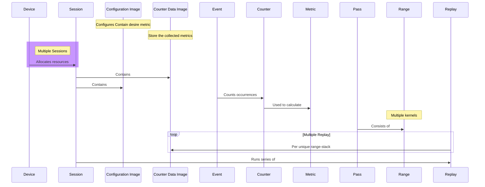

# Profile the Kernel Using CUpti profiling API




* **CUDA_INJECTION64_PATH** is set to a shared library
* **INJECTION_KERNEL_COUNT**: This sets the number of kernels in a session
* **INJECTION_METRICS**: This sets the metrics to gather, separated by space, comma,or semicolon.  Default metrics are:
            sm__cycles_elapsed.avg
            gpu__time_duration.sum

```sh
#build example
bazel build //src:reduce 

#build shared lib
bazel build --config=rules_cuda //lib:injection_shared_using_rules_cuda 

#profile
env INJECTION_KERNEL_COUNT=2 CUDA_INJECTION64_PATH=./bazel-bin/lib/libinjection.so bazel-bin/src/reduce 16777216 256 256 1
```

| Range Name | Metric Name               | Metric Value (ns)|
|------------|---------------------------|------------------|
| 0          | gpu__time_duration.sum    | 73920.000000     |
| 1          | gpu__time_duration.sum    | 1472.000000      |
| 0          | sm__cycles_elapsed.avg    | 185964.296875    |
| 1          | sm__cycles_elapsed.avg    | 3650.703125      |
